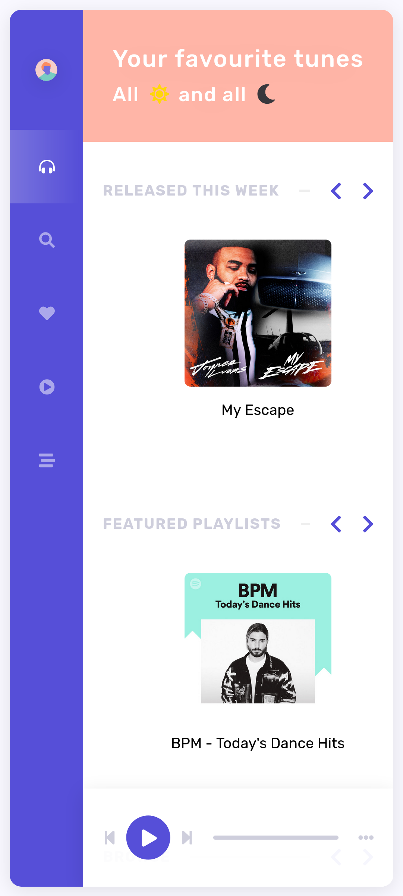
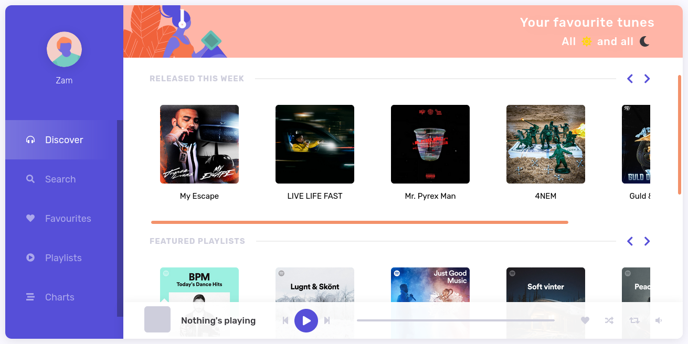
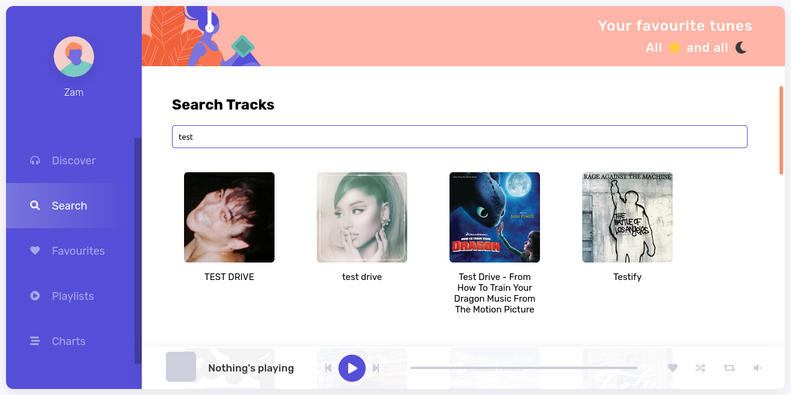
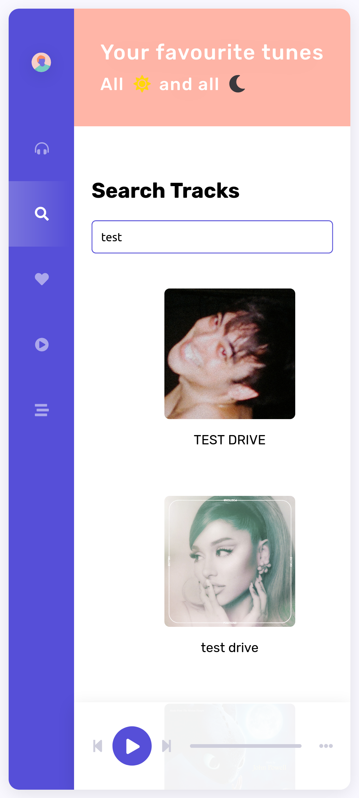

# Spootify

ReactJS demo application to display Spotify data

## Requirements

- [Spotify API credentials](https://developer.spotify.com/console/)
- ReactJS
- Node.js >= 15.0.0
- NPM >= 8.1.2

## Installation

### Clone this repository

```
$ git clone https://github.com/zamronypj/envision-spootify.git
```

### Install dependencies
This application consists of server and client. Run `npm install` separately for each of them.

Install dependencies for client application
```
$ cd envision-spootify/client
$ npm install
```

Install dependencies for server application
```
$ cd envision-spootify/server
$ npm install
```

## Setup configuration

## For server
Set environment variable for Spotify API client ID, client secret key and redirect URI

```
$ export REACT_APP_SPOTIFY_CLIENT_ID="your spotify client id"
$ export REACT_APP_SPOTIFY_CLIENT_SECRET="your spotify client secret"
$ export REACT_APP_SPOTIFY_REDIRECT_URI="your spotify redirect uri"
```
You need to make sure that redirect URI matched whitelisted redirect URI set in your Spotify API developer dashboard. So if you set `REACT_APP_SPOTIFY_REDIRECT_URI` to `http://localhost:3000/`, in Spotify API dashboard, you need to whitelist in *Edit Settings*.

### For client

Copy configuration file

```
$ cp config.js.example config.js
```
Edit Spotify API client ID and redirect URI to match your own.

Client application run on browser so NEVER store your client secret.

## Run application

### For client

```
$ cd envision-spootify/client
$ npm start
```

### For server

Make sure you have required environment variables properly set as described above.

```
$ cd envision-spootify/server
$ npm start
```

By default it will run in `http://localhost:3000`.

## Screenshots
Home page



Search page




## Copyright Notice and Credit

Server part is modified version of

https://github.com/dipscoder/spotify-clone.git


Client part is modified  version of

https://github.com/alexgurr/react-coding-challenges/tree/master/spootify
